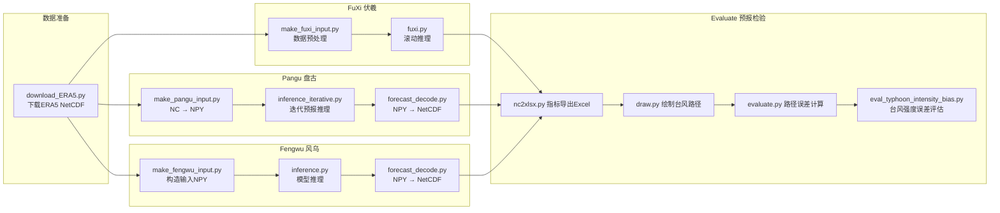

# typhoon-forecast-verification
本项目基于盘古、伏羲、风乌气象大模型开展台风预报试验，对比多模型台风路径、强度预报误差并定量检验。
预报检验的时间范围：2026年7月4日6时~2023年7月20日06时（UTC时间）
预报检验的时间分辨率：逐6小时

## 简介

## 硬件配置要求
- **盘古(Pangu-Weather)**：≥32GB 内存；支持 8C32G CPU 推理 或 V100 GPU
- **伏羲(FuXi)、风乌(Fengwu)**：必须使用GPU算力运行，比如V100 GPU
## 项目目录简要说明
```
project/
├── download_ERA5.py                             # ERA5批量下载
├── Fuxi/                                        # 伏羲模型 预处理+推理计算
├── Pangu/                                       # 盘古模型 预处理+推理计算
├── Fengwu/                                      # 风乌模型 预处理+推理计算
├── evaluate/
│   ├── nc2xlsx.py
│   ├── draw.py
│   ├── evaluate.py
│   └── eval_typhoon_intensity_bias.py          # 台风强度偏差评估
└── README.md
```


## 1. 环境与数据准备
### 1.1 系统配置
本项目模型推理计算部分建议使用V100 GPU算力，数据分析部分使用8核32G CPU以上算力（显存必须大于32G）
本项目运行目录为 /home/mw

### 1.2 安装依赖
```bash
pip install cdsapi numpy netCDF4 onnxruntime xarray matplotlib pandas
```

### 1.3 ERA5数据下载
1. 配置CDS认证文件
在服务器家目录创建 `~/.cdsapirc`
```
url: https://cds.climate.copernicus.eu/api/v2
key: <你的CDS TOKEN>
```
> Token 获取地址：https://cds.climate.copernicus.eu/profile

2. 执行下载脚本
```bash
python download_ERA5.py
```
ERA5原始数据默认下载目录：
`/home/mw/input/meteo4553/ERA5`

### 1.4 模型权重准备
自行下载盘古、伏羲、风乌预训练模型权重，放置到对应路径：
- 盘古模型：`/home/mw/input/pangu5747/`
- 伏羲模型：`/home/mw/input/weather1778/FuXi_EC`
- 风乌模型：`/home/mw/input/weather5373/fengwu_v2.onnx`

## 2. 模型推理流程
> 架构说明：流程拆分为「数据预处理 → 模型推理 → 结果解码」多个独立脚本，**不合并为单一一键脚本**。
> 原因：气象模型滚动推理耗时极长，拆分脚本可实现断点续跑；任务中断后无需从头执行全部流程，仅重新运行失败阶段即可。

预报输出总目录：`/home/mw/input/evaluate7266/`
- 盘古预报结果：`/home/mw/input/evaluate7266/pangu/`
- 伏羲预报结果：`/home/mw/input/evaluate7266/fuxi/`
- 风乌预报结果：`/home/mw/input/evaluate7266/fengwu/`

### 2.1 伏羲 FuXi 运行方式
```bash
# 1. ERA5原始NetCDF转为伏羲输入格式
cd Fuxi
python make_fuxi_input.py \
--init_time '20260706' \
--init_time_type 'case1' \
--raw_data_root_path '/home/mw/input/meteo4553/ERA5' \
--raw_data_format_type 'netcdf' \
--save_dir '/home/mw/temp'

# 2. 滚动推理
python fuxi.py \
--model /home/mw/input/weather1778/FuXi_EC \
--input /home/mw/temp/20230723-06_input_netcdf.nc \
--save_dir /home/mw/temp/Fuxi \
--num_steps 20 20 20
```

### 2.2 盘古 Pangu-Weather 运行方式
模型权重路径
```
model_24 = '/home/mw/input/pangu5747/pangu_weather_24.onnx' # 24h预报
model_6  = '/home/mw/input/pangu5747/pangu_weather_6.onnx'  # 6h预报
model_3  = '/home/mw/input/pangu5747/pangu_weather_3.onnx'  # 3h预报
model_1  = '/home/mw/input/pangu5747/pangu_weather_1.onnx'  # 1h预报
```

执行流程
```bash
cd Pangu
# 1. NetCDF 转为模型输入npy
python make_pangu_input.py

# 2. 迭代滚动推理（三选一）
python inference_iterative.py
# python inference_iterative_v2.py
# python inference_iterative_v3.py

# 3. 推理输出npy转NetCDF，便于气象分析
python forecast_decode.py
```
推理输出npy文件存储至中间目录，解码后的nc文件汇总输出到盘古结果目录。

### 2.3 风乌 Fengwu 运行方式
```bash
cd Fengwu
# 1. 构造模型输入数据，TEMP目录生成 fengwu_input1.npy、fengwu_input2.npy
python make_fengwu_input.py

# 2. 模型推理
python inference.py

# 3. npy预测结果转NetCDF
python forecast_decode.py
```

## 3. 预报结果评估与可视化
进入evaluate文件夹开展检验分析
```bash
cd evaluate

# 1. nc预报数据提取路径经纬度，导出Excel表格
python nc2xlsx.py

# 2. 绘制多模型台风路径图
python draw.py

# 3. 计算台风中心距离误差（路径误差）
python evaluate.py

# 4. 台风强度误差定量评估（最大风速、中心气压偏差、RMSE、MAE）
python eval_typhoon_intensity_bias.py
```


## 注意事项
1. CDS API密钥、服务器路径信息请勿直接提交至代码仓库；
2. 模型权重、原始ERA5数据、生成的npy/nc文件体积巨大，不上传Git；
